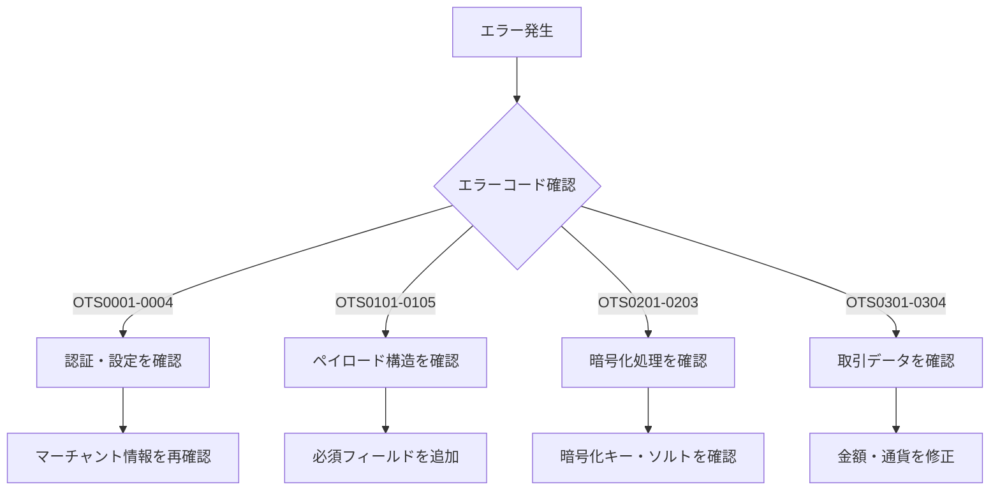
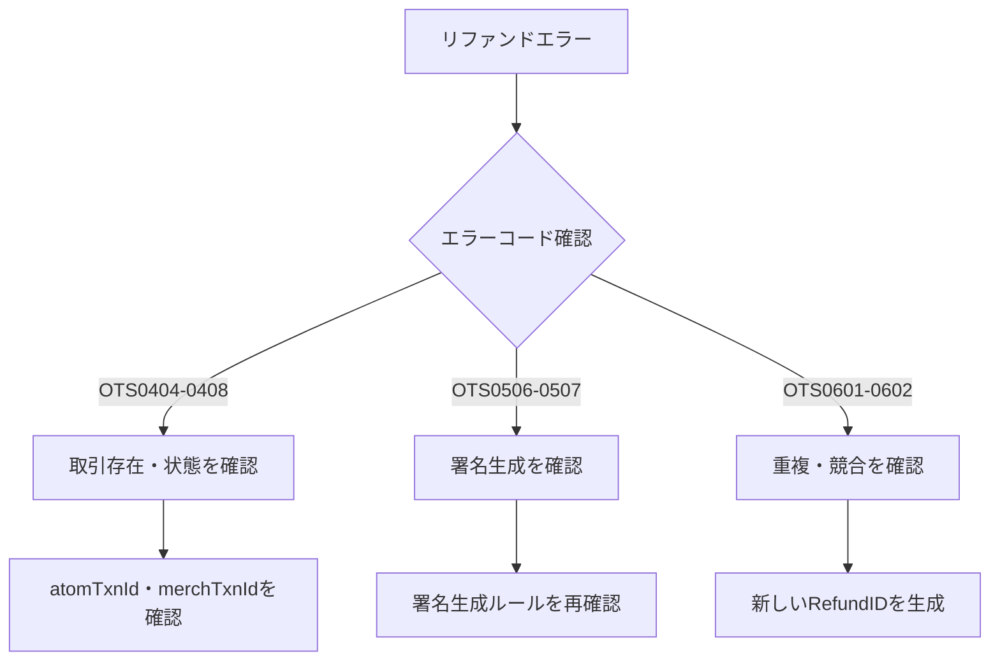

# Atom Payment Gateway エラーコード辞書

## 📋 **成功コード**

| コード | メッセージ | 説明 |
|## 📊 **ReconStatus値の詳細**

| ステータス | 名称 | 説明 | 対処法 |
|------------|------|------|--------|
| `RS` | Reconciled Settled | 調整済み・決済済み | 正常完了 |
| `RNS` | Reconciled Not Settled | 調整済み・未決済 | 決済処理待ち |
| `NRNS` | Not Reconciled Not Settled | 未調整・未決済 | 調整前状態 |
| `PNRNS` | Payment Not Reconciled Not Settled | T0決済で未調整・未決済 | T0決済での未調整状態 |
| `PNRS` | Payment Not Reconciled Settled | 未調整・決済済み | 決済済みだが未調整 |

---

## 🔧 **暗号化キー参考値**

| MerchId | reqHashKey | respHashKey | encReqKey | encResKey |
|---------|------------|-------------|-----------|-----------|
| 317157 | KEY123657234 | KEYRESP123657234 | A4476C2062FFA58980DC8F79EB6A799E | 75AEF0FA1B94B3C10D4F5B268F757F11 |

--------|------------|------|
| `OTS0000` | SUCCESS | 正常に処理が完了しました |

---

## 🌐 **HTTPステータスコード**

| コード | 説明 | 詳細 |
|--------|------|------|
| `200` | Success | リクエストが正常に処理されました |
| `400` | VALIDATION FAILED | ペイロードの検証に失敗しました |
| `401` | AUTH SERVICE FAILED | 認証サービスでエラーが発生しました |
| `402` | TOKEN GENERATION FAILED | トークン生成に失敗しました |
| `403` | INVALID MERCHANT INFORMATION | マーチャント情報が無効です |

---

## ❌ **決済関連エラー**

### **認証・設定エラー**
| コード | メッセージ | 原因 | 対処法 |
|--------|------------|------|--------|
| `OTS0001` | Authentication Failed | マーチャントID/パスワードが間違っている | 認証情報を確認 |
| `OTS0002` | Merchant Not Active | マーチャントアカウントが無効 | Atomサポートに連絡 |
| `OTS0003` | Invalid Merchant Configuration | マーチャント設定に問題あり | 設定を見直し |
| `OTS0004` | Service Not Available | サービスが利用できない | 時間をおいて再試行 |

### **ペイロード・データエラー**
| コード | メッセージ | 原因 | 対処法 |
|--------|------------|------|--------|
| `OTS0101` | Invalid Request Format | リクエスト形式が正しくない | ペイロード構造を確認 |
| `OTS0102` | Missing Required Fields | 必須フィールドが不足 | 必要な項目を追加 |
| `OTS0103` | Invalid Field Value | フィールド値が不正 | データ型・形式を確認 |
| `OTS0104` | Field Length Exceeded | フィールド長が制限を超過 | 文字数を確認 |
| `OTS0105` | Invalid Date Format | 日付形式が正しくない | YYYY-MM-DD hh:mm:ss形式に修正 |

### **暗号化・署名エラー**
| コード | メッセージ | 原因 | 対処法 |
|--------|------------|------|--------|
| `OTS0201` | Decryption Failed | 復号化に失敗 | 暗号化キー・ソルトを確認 |
| `OTS0202` | Invalid Encryption Format | 暗号化形式が正しくない | 16進数大文字で暗号化 |
| `OTS0203` | Encryption Key Mismatch | 暗号化キーが一致しない | リクエスト用キーを確認 |

### **取引関連エラー**
| コード | メッセージ | 原因 | 対処法 |
|--------|------------|------|--------|
| `OTS0301` | Duplicate Transaction | 重複した取引ID | 新しいmerchTxnIdを生成 |
| `OTS0302` | Invalid Transaction Amount | 金額が不正 | 正の数値を設定 |
| `OTS0303` | Amount Limit Exceeded | 金額上限を超過 | 金額を制限内に設定 |
| `OTS0304` | Invalid Currency | 通貨コードが不正 | サポートされた通貨を使用 |

---

## 💸 **リファンド関連エラー**

### **リファンド処理エラー**
| コード | メッセージ | 原因 | 対処法 |
|--------|------------|------|--------|
| `OTS0404` | Transaction Not Found | 指定された取引が見つからない | atomTxnId・merchTxnIdを確認 |
| `OTS0405` | Transaction Not Eligible for Refund | リファンド対象外の取引 | 取引ステータスを確認 |
| `OTS0406` | Refund Amount Exceeds Original | リファンド金額が元の金額を超過 | 金額を元の決済金額以下に設定 |
| `OTS0407` | Partial Refund Not Allowed | 部分リファンドが許可されていない | 全額リファンドを実行 |
| `OTS0408` | Refund Window Expired | リファンド期限が過ぎている | 期限内に処理を実行 |

### **署名関連エラー**
| コード | メッセージ | 原因 | 対処法 |
|--------|------------|------|--------|
| `OTS0506` | Signature Mismatched | 署名が一致しない | 署名生成ロジックを確認 |
| `OTS0507` | Invalid Signature Format | 署名形式が正しくない | 16進数小文字で生成 |

### **重複・競合エラー**
| コード | メッセージ | 原因 | 対処法 |
|--------|------------|------|--------|
| `OTS0601` | Duplicate Refund Request | 重複したリファンドリクエスト | 新しいprodRefundIdを生成 |
| `OTS0602` | Concurrent Refund Processing | 同時リファンド処理中 | 処理完了後に再試行 |

---

## 🔧 **システム・ネットワークエラー**

### **システムエラー**
| コード | メッセージ | 原因 | 対処法 |
|--------|------------|------|--------|
| `OTS0701` | Internal Server Error | サーバー内部エラー | 時間をおいて再試行 |
| `OTS0702` | Database Connection Error | データベース接続エラー | システム復旧を待機 |
| `OTS0703` | Service Temporarily Unavailable | サービス一時停止中 | メンテナンス完了を待機 |

### **ネットワークエラー**
| コード | メッセージ | 原因 | 対処法 |
|--------|------------|------|--------|
| `OTS0801` | Request Timeout | リクエストタイムアウト | タイムアウト時間を延長 |
| `OTS0802` | Network Connection Failed | ネットワーク接続失敗 | ネットワーク環境を確認 |

---

## 🚨 **緊急対応が必要なエラー**

### **セキュリティ関連**
| コード | メッセージ | 対応レベル | 対処法 |
|--------|------------|------------|--------|
| `OTS0901` | Suspicious Activity Detected | 🔴 緊急 | セキュリティチームに連絡 |
| `OTS0902` | Rate Limit Exceeded | 🟡 注意 | リクエスト頻度を調整 |
| `OTS0903` | IP Address Blocked | 🟡 注意 | IPホワイトリストを確認 |

---

## 🔍 **エラー診断フローチャート**

### **決済エラー診断**


### **リファンドエラー診断**


---

## 🛠️ **エラーハンドリング実装例**

### **基本的なエラーハンドリング**
```javascript
function handleAtomError(responseData) {
  const statusCode = responseData.responseDetails?.statusCode;
  
  switch(statusCode) {
    case 'OTS0000':
      return { success: true, message: '処理が正常に完了しました' };
      
    case 'OTS0001':
      return { 
        success: false, 
        error: 'AUTHENTICATION_FAILED',
        message: 'マーチャント認証に失敗しました。認証情報を確認してください。',
        action: 'CHECK_CREDENTIALS'
      };
      
    case 'OTS0404':
      return {
        success: false,
        error: 'TRANSACTION_NOT_FOUND', 
        message: '指定された取引が見つかりません。取引IDを確認してください。',
        action: 'CHECK_TRANSACTION_ID'
      };
      
    case 'OTS0506':
      return {
        success: false,
        error: 'SIGNATURE_MISMATCH',
        message: '署名が一致しません。署名生成ロジックを確認してください。',
        action: 'CHECK_SIGNATURE_LOGIC'
      };
      
    default:
      return {
        success: false,
        error: 'UNKNOWN_ERROR',
        message: `未知のエラーが発生しました: ${statusCode}`,
        action: 'CONTACT_SUPPORT'
      };
  }
}
```

### **詳細なエラーログ**
```javascript
function logAtomError(error, context) {
  const errorLog = {
    timestamp: new Date().toISOString(),
    errorCode: error.statusCode,
    errorMessage: error.message,
    context: {
      endpoint: context.endpoint,
      merchId: context.merchId,
      txnId: context.txnId,
      amount: context.amount
    },
    troubleshootingSteps: getErrorSteps(error.statusCode)
  };
  
  console.error('Atom Payment Error:', JSON.stringify(errorLog, null, 2));
  
  // 緊急対応が必要なエラーの場合はアラート送信
  if (['OTS0901', 'OTS0902'].includes(error.statusCode)) {
    sendSecurityAlert(errorLog);
  }
}

function getErrorSteps(statusCode) {
  const steps = {
    'OTS0001': ['マーチャントID確認', 'パスワード確認', 'アカウント状態確認'],
    'OTS0404': ['atomTxnId確認', 'merchTxnId確認', '取引存在確認'],
    'OTS0506': ['署名文字列確認', 'ハッシュキー確認', '署名生成ロジック確認']
  };
  
  return steps[statusCode] || ['サポートに連絡'];
}
```

---

## 📞 **サポート連絡時の情報**

### **必要な情報リスト**
```yaml
基本情報:
  - エラーコード
  - エラーメッセージ
  - 発生日時
  - マーチャントID

取引情報:
  - merchTxnId
  - atomTxnId (ある場合)
  - 金額
  - 通貨

技術情報:
  - 使用しているAPI (AUTH/REFUND/STATUS)
  - 暗号化実装方法
  - 署名生成方法
  - エラー発生頻度
```

### **サポート連絡テンプレート**
```
件名: [エラーコード] Atom Payment Gateway エラー報告

マーチャントID: [YOUR_MERCHANT_ID]
エラーコード: [ERROR_CODE]  
エラーメッセージ: [ERROR_MESSAGE]
発生日時: [TIMESTAMP]

取引詳細:
- merchTxnId: [TRANSACTION_ID]
- atomTxnId: [ATOM_TRANSACTION_ID]
- 金額: [AMOUNT]
- 通貨: [CURRENCY]

実行したAPI: [AUTH/REFUND/STATUS]
期待していた結果: [EXPECTED_RESULT]
実際の結果: [ACTUAL_RESULT]

追加情報:
[ANY_ADDITIONAL_CONTEXT]
```