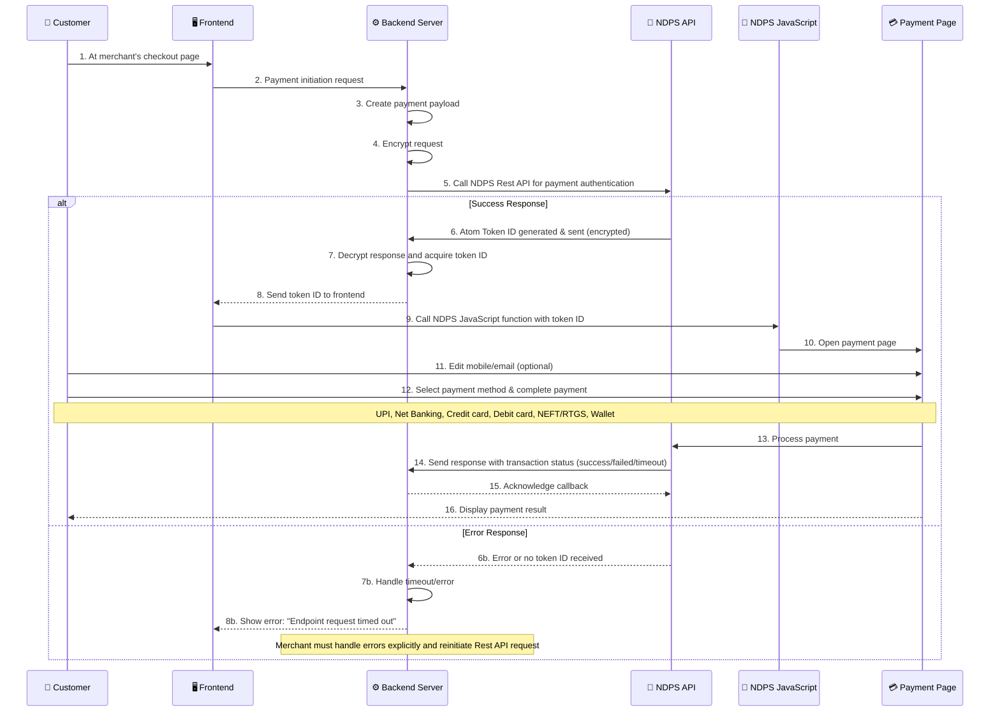
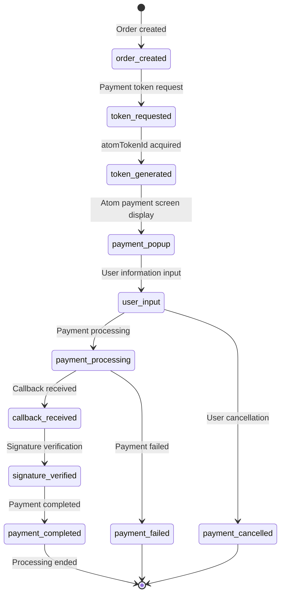

# Atom Payment Gateway Integration Guide

## 🔄 **Complete Atom Payment Flow Diagram**



---

## ⚠️ **Important: returnUrl Specification**

### **Post-Payment Redirect Specification**
```yaml
method: "POST"          # ❌ Not GET ✅ POST
content-type: "application/x-www-form-urlencoded"
```

### **Correct returnUrl Implementation**
```javascript
// ❌ Wrong implementation (GET)
app.get('/payment/success', (req, res) => {
    // This won't execute because data is sent via POST
});

// ✅ Correct implementation (POST)
app.post('/payment/success', (req, res) => {
    // Payment result is sent from Atom via POST
    const paymentData = req.body;
    
    res.send(`
        <h2>Payment Completed</h2>
        <p>Thank you!</p>
        <p>Transaction ID: ${paymentData.txnId || 'N/A'}</p>
    `);
});
```

---

## 🎯 **Important Integration Points**

### **1. Payment Screen Implementation Method**
- **❌ Custom payment form**: Custom implementation of card number input fields, etc.
- **✅ Atom Official SDK**: Popup payment screen using JavaScript SDK

### **2. Required Technical Elements**
- **Atom JavaScript SDK**: For payment screen display
- **Server-side encryption**: AES-256-CBC + PBKDF2
- **Signature verification**: HMAC-SHA512
- **Double confirmation**: returnUrl + callback

### **3. Data Flow Characteristics**
- **Token-based**: Get atomTokenId on server, then execute payment on frontend
- **Asynchronous processing**: Payment completion received via callback
- **Signature required**: Signature verification required for all communications

---

## 📁 **Minimal Configuration Project Template** ⭐ **DEFAULT CHOICE**

### **🎯 2-File Setup (Recommended for Demos/Learning/MVP)**
Show file setup directory for user.
```
project-name/
├── 🚀 server.js                    # Express API + Static Serving + NDPSI Integration
├── 🎨 index.html                   # Frontend UI (Embedded CSS/JS)
└── 📦 package.json                 # Dependencies Definition
```


### ** 🚨Setup Requirements (3 Steps Only)**

Don't create package.json as another file. Let npm generate it automatically (via npm init or npm install).
Keep dependencies minimal - use only express and crypto if possible.
```bash
# Step 1: Install dependencies
npm install express crypto

# Step 2: Start server  
node server.js

# Step 3: Access application
# → http://localhost:3000
```


### **🔧 Implementation Specifications**

#### **server.js Must Include:**
- ✅ `app.use(express.static('.'))` for serving index.html
- ✅ `app.get('/', (req, res) => res.sendFile(path.join(__dirname, 'index.html')))`
- ✅ NDPSI Atom encryption/decryption functions
- ✅ API routes: `/api/*` endpoints
- ✅ Payment callback handler: `/payment-callback`
- ✅ Success page handler: `/payment-success`

#### **index.html Must Include:**
- ✅ Embedded CSS (no external stylesheets)
- ✅ Embedded JavaScript (no external JS files except Atom SDK)
- ✅ `fetch('/api/endpoint')` for API communication
- ✅ Atom SDK integration: `<script src="https://pgtest.atomtech.in/..."></script>`
- ✅ Responsive design for mobile/desktop

### **🚨 IMPORTANT: Default Implementation Rules**

**When creating demos/examples/learning projects, ALWAYS use this 2-file structure unless explicitly requested otherwise.**

**File Dependency Flow:**
```
server.js (port 3000)
    ↓ serves
index.html (embedded CSS/JS)
    ↓ calls
/api/* endpoints (in server.js)
    ↓ integrates  
NDPSI Atom Payment APIs
```

### **🎯 When to Use This Pattern:**
- ✅ Demos and prototypes
- ✅ Learning/educational projects  
- ✅ MVP development
- ✅ Quick setup requirements
- ✅ Single developer projects
- ❌ Large-scale production apps (use separated architecture)

**🎯 REMEMBER: This 2-file pattern should be the DEFAULT choice for 90% of implementation requests.**

---

## 💻 **Accurate JavaScript SDK Implementation**

### **Atom SDK Specification (Officially Confirmed)**

```javascript
// 1. Required CDN loading
// UAT Environment
<script src="https://pgtest.atomtech.in/staticdata/ots/js/atomcheckout.js"></script>

// Production Environment  
<script src="https://psa.atomtech.in/staticdata/ots/js/atomcheckout.js"></script>

// 2. Payment initiation function
function openPay() {
    const options = {
        "atomTokenId": "atomTokenId",        // Retrieved from backend
        "merchId": "8952",                   // Merchant ID
        "custEmail": "testuser@ndps.in",     // Customer email address
        "custMobile": "8888888888",          // Customer phone number
        "returnUrl": "http://your-response-url/response.php"  // Post-payment redirect destination
    };
    
    let atom = new AtomPaynetz(options, 'uat');  // 'uat' or 'prod'
}
```

### **Complete Working Example (1 File)**

```javascript
const express = require('express');
const crypto = require('crypto');
const axios = require('axios');

// ===== Configuration =====
const CONFIG = {
    MERCHANT_ID: "317157",
    PASSWORD: "Test@123", 
    REQ_ENC_KEY: "A4476C2062FFA58980DC8F79EB6A799E",
    REQ_SALT: "A4476C2062FFA58980DC8F79EB6A799E",
    REQ_HASH_KEY: "KEY123657234",
    RES_ENC_KEY: "75AEF0FA1B94B3C10D4F5B268F757F11", 
    RES_SALT: "75AEF0FA1B94B3C10D4F5B268F757F11",
    HASH_KEY: "KEYRESP123657234",  // For response signature verification
    API_URL: "https://paynetzuat.atomtech.in",
    SCRIPT_URL: "https://pgtest.atomtech.in/staticdata/ots/js/atomcheckout.js"
};

const app = express();
app.use(express.urlencoded({ extended: true }));
app.use(express.json());

// ===== Atom Encryption =====
function encrypt(data) {
    const iv = Buffer.from([0,1,2,3,4,5,6,7,8,9,10,11,12,13,14,15]);
    const key = crypto.pbkdf2Sync(CONFIG.REQ_ENC_KEY, CONFIG.REQ_SALT, 65536, 32, 'sha512');
    const cipher = crypto.createCipheriv('aes-256-cbc', key, iv);
    
    let encrypted = cipher.update(JSON.stringify(data), 'utf8');
    encrypted = Buffer.concat([encrypted, cipher.final()]);
    return encrypted.toString('hex').toUpperCase();
}

function decrypt(hexString) {
    const iv = Buffer.from([0,1,2,3,4,5,6,7,8,9,10,11,12,13,14,15]);
    const key = crypto.pbkdf2Sync(CONFIG.RES_ENC_KEY, CONFIG.RES_SALT, 65536, 32, 'sha512');
    const decipher = crypto.createDecipheriv('aes-256-cbc', key, iv);
    
    const encrypted = Buffer.from(hexString, 'hex');
    let decrypted = decipher.update(encrypted);
    decrypted = Buffer.concat([decrypted, decipher.final()]);
    return JSON.parse(decrypted.toString('utf8'));
}

// Signature verification (for callback)
function verifySignature(callbackData) {
    const r = callbackData.payInstrument;
    
    // Create signature string (according to official specification)
    const signatureString = [
        r.merchDetails.merchId,
        r.payDetails.atomTxnId,
        r.merchDetails.merchTxnId,
        Number(r.payDetails.totalAmount).toFixed(2),
        r.responseDetails.statusCode,
        r.payModeSpecificData.subChannel[0],
        r.payModeSpecificData.bankDetails.bankTxnId
    ].join('');
    
    const calculatedSignature = crypto.createHmac('sha512', CONFIG.HASH_KEY)
        .update(signatureString).digest('hex');
    
    return calculatedSignature === r.payDetails.signature;
}

// ===== Routes =====
// Main screen
app.get('/', (req, res) => {
    res.send(`
        <h2>Product Purchase</h2>
        <p>Price: ₹100</p>
        <form action="/payment" method="post">
            <input type="email" name="email" placeholder="Email" required>
            <input type="tel" name="phone" placeholder="Phone Number" required>
            <button type="submit">Make Payment</button>
        </form>
    `);
});

// Payment initiation
app.post('/payment', async (req, res) => {
    const txnId = `TXN_${Date.now()}`;
    
    // Atom API payload
    const payload = {
        payInstrument: {
            headDetails: { api: "AUTH", version: "OTSv1.1", platform: "FLASH" },
            merchDetails: {
                merchId: CONFIG.MERCHANT_ID,
                password: CONFIG.PASSWORD,
                merchTxnId: txnId,
                merchTxnDate: new Date().toISOString().slice(0, 19).replace('T', ' ')
            },
            payDetails: { amount: 100, product: "TEST", txnCurrency: "INR" },
            custDetails: { custEmail: req.body.email, custMobile: req.body.phone }
        }
    };
    
    // Atom API call
    const encData = encrypt(payload);
    const formData = `encData=${encodeURIComponent(encData)}&merchId=${CONFIG.MERCHANT_ID}`;
    
    try {
        const response = await axios.post(`${CONFIG.API_URL}/ots/aipay/auth`, formData, {
            headers: { 'Content-Type': 'application/x-www-form-urlencoded' }
        });
        
        const match = response.data.match(/encData=([^&]+)/);
        const result = decrypt(decodeURIComponent(match[1]));
        
        if (result.responseDetails?.txnStatusCode === 'OTS0000') {
            // Display payment screen (accurate SDK specification)
            res.send(`
                <!DOCTYPE html>
                <html>
                <head>
                    <title>Payment Processing</title>
                    <script src="${CONFIG.SCRIPT_URL}"></script>
                </head>
                <body>
                    <h2>Payment Processing</h2>
                    <p>Transaction ID: ${txnId}</p>
                    <p>Amount: ₹100</p>
                    <button onclick="openPay()">Start Payment</button>
                    
                    <script>
                    function openPay() {
                        const options = {
                            "atomTokenId": "${result.atomTokenId}",
                            "merchId": "${CONFIG.MERCHANT_ID}",
                            "custEmail": "${req.body.email}",
                            "custMobile": "${req.body.phone}",
                            "returnUrl": "http://localhost:3000/success?txnId=${txnId}"
                        };
                        let atom = new AtomPaynetz(options, 'uat');
                    }
                    </script>
                </body>
                </html>
            `);
        } else {
            res.send('<h2>Error</h2><p>Payment initialization failed</p>');
        }
    } catch (error) {
        res.send(`<h2>Error</h2><p>${error.message}</p>`);
    }
});

// Payment completion (returnUrl - Important: Receive via POST)
app.post('/success', (req, res) => {
    // Payment result is sent from Atom via POST
    const txnId = req.query.txnId || req.body.txnId;
    
    console.log('returnUrl POST data:', req.body);
    
    res.send(`
        <!DOCTYPE html>
        <html>
        <head><title>Payment Completed</title></head>
        <body>
            <h2>Payment Completed</h2>
            <p>Transaction ID: ${txnId}</p>
            <p>Thank you!</p>
            <p><small>※ Payment result will be finalized via callback</small></p>
        </body>
        </html>
    `);
});

// Payment result callback (final confirmation)
app.post('/callback', (req, res) => {
    try {
        const result = decrypt(req.body.encData);
        
        // Signature verification
        if (!verifySignature(result)) {
            console.error('Signature verification failed');
            return res.status(400).send('Invalid signature');
        }
        
        const paymentResult = result.payInstrument;
        const status = paymentResult.responseDetails.statusCode;
        
        if (status === 'OTS0000') {
            console.log('✅ Payment successful:', {
                txnId: paymentResult.merchDetails.merchTxnId,
                atomTxnId: paymentResult.payDetails.atomTxnId,
                amount: paymentResult.payDetails.totalAmount,
                paymentMethod: paymentResult.payModeSpecificData.subChannel[0],
                bankName: paymentResult.payModeSpecificData.bankDetails.otsBankName
            });
        } else {
            console.log('❌ Payment failed:', status, paymentResult.responseDetails.description);
        }
        
        res.send('OK');  // Notify Atom of processing completion
    } catch (error) {
        console.error('Callback error:', error);
        res.status(500).send('Error');
    }
});

app.listen(3000, () => console.log('Server started: http://localhost:3000'));
```

---

## ⚙️ **Accurate Configuration File**

```javascript
// config/atom.js - Environment-specific configuration
const AtomConfig = {
    UAT: {
        MERCHANT_ID: "317157",
        PASSWORD: "Test@123",
        REQ_ENC_KEY: "A4476C2062FFA58980DC8F79EB6A799E",
        REQ_SALT: "A4476C2062FFA58980DC8F79EB6A799E",
        REQ_HASH_KEY: "KEY123657234",
        RES_ENC_KEY: "75AEF0FA1B94B3C10D4F5B268F757F11", // Response key differs from request key, required
        RES_SALT: "75AEF0FA1B94B3C10D4F5B268F757F11",
        RES_HASH_KEY: "KEYRESP123657234",
        API_BASE_URL: "https://paynetzuat.atomtech.in",
        SCRIPT_URL: "https://pgtest.atomtech.in/staticdata/ots/js/atomcheckout.js",
        ENVIRONMENT: "uat"
    },
    PRODUCTION: {
        MERCHANT_ID: process.env.ATOM_MERCHANT_ID,
        PASSWORD: process.env.ATOM_PASSWORD,
        REQ_ENC_KEY: process.env.REQ_ENC_KEY,
        REQ_SALT: process.env.REC_SALT,
        REQ_HASH_KEY: process.env.REQ_HASH_KEY,
        RES_ENC_KEY: process.env.RES_ENC_KEY,
        RES_SALT: process.env.RES_SALT,
        RES_HASH_KEY: process.env.RES_HASH_KEY,
        API_BASE_URL: "https://payment1.atomtech.in",
        SCRIPT_URL: "https://payment1.atomtech.in/staticdata/ots/js/atomcheckout.js",
        ENVIRONMENT: "prod"
    }
};

// Usage example
const config = process.env.NODE_ENV === 'production' ? 
    module.exports.PROD : module.exports.UAT;
```

---

## 🔐 **Accurate Signature Verification Implementation**

```javascript
// atom-crypto.js - Complete version
const crypto = require('crypto');

class AtomCrypto {
    constructor(encKey, hashKey, salt) {
        this.encKey = encKey;
        this.hashKey = hashKey;  // For response signature verification
        this.salt = salt;
        this.iv = Buffer.from([0,1,2,3,4,5,6,7,8,9,10,11,12,13,14,15]);
        
        // Key derivation
        this.derivedKey = crypto.pbkdf2Sync(encKey, salt, 65536, 32, 'sha512');
    }

    encrypt(data) {
        const cipher = crypto.createCipheriv('aes-256-cbc', this.derivedKey, this.iv);
        let encrypted = cipher.update(JSON.stringify(data), 'utf8');
        encrypted = Buffer.concat([encrypted, cipher.final()]);
        return encrypted.toString('hex').toUpperCase();
    }

    decrypt(hexString) {
        const decipher = crypto.createDecipheriv('aes-256-cbc', this.derivedKey, this.iv);
        const encrypted = Buffer.from(hexString, 'hex');
        let decrypted = decipher.update(encrypted);
        decrypted = Buffer.concat([decrypted, decipher.final()]);
        return JSON.parse(decrypted.toString('utf8'));
    }

    // Signature verification according to official specification
    verifySignature(callbackData) {
        const r = callbackData.payInstrument;
        
        // Signature string: merchId + atomTxnId + merchTxnId + totalAmount + statusCode + subChannel + bankTxnId
        const signatureString = [
            r.merchDetails.merchId.toString(),
            r.payDetails.atomTxnId.toString(),
            r.merchDetails.merchTxnId.toString(),
            Number(r.payDetails.totalAmount).toFixed(2),
            r.responseDetails.statusCode.toString(),
            r.payModeSpecificData.subChannel[0].toString(),
            r.payModeSpecificData.bankDetails.bankTxnId.toString()
        ].join('');
        
        const calculated = crypto.createHmac('sha512', this.hashKey)
            .update(signatureString).digest('hex');
        
        return {
            isValid: calculated === r.payDetails.signature,
            calculated: calculated,
            received: r.payDetails.signature,
            signatureString: signatureString
        };
    }
}

module.exports = AtomCrypto;
```

---

## 📋 **Payment Response Processing Example**

```javascript
// Detailed callback processing
app.post('/callback', (req, res) => {
    try {
        const callbackData = decrypt(req.body.encData);
        const verificationResult = verifySignature(callbackData);
        
        if (!verificationResult.isValid) {
            console.error('Signature verification failed:', verificationResult);
            return res.status(400).send('Invalid signature');
        }
        
        const payment = callbackData.payInstrument;
        const isSuccess = payment.responseDetails.statusCode === 'OTS0000';
        
        if (isSuccess) {
            // Payment success processing
            const paymentInfo = {
                merchantTxnId: payment.merchDetails.merchTxnId,
                atomTxnId: payment.payDetails.atomTxnId,
                amount: payment.payDetails.totalAmount,
                currency: payment.payDetails.txnCurrency,
                paymentMethod: payment.payModeSpecificData.subChannel[0],
                bankName: payment.payModeSpecificData.bankDetails.otsBankName,
                cardMask: payment.payModeSpecificData.bankDetails.cardMaskNumber || null,
                bankTxnId: payment.payModeSpecificData.bankDetails.bankTxnId,
                completedAt: payment.payDetails.txnCompleteDate
            };
            
            // Database save processing
            console.log('✅ Payment successful:', paymentInfo);
            
        } else {
            // Payment failure processing
            console.log('❌ Payment failed:', {
                txnId: payment.merchDetails.merchTxnId,
                statusCode: payment.responseDetails.statusCode,
                description: payment.responseDetails.description
            });
        }
        
        res.send('OK');  // Always notify Atom of processing completion
        
    } catch (error) {
        console.error('Callback processing error:', error);
        res.status(500).send('Error');
    }
});
```

---

## 🎯 **Implementation Checklist**

### **Required Implementation Items**
- [ ] Loading Atom JavaScript SDK
- [ ] Payment token acquisition API (with encryption support)
- [ ] Payment screen launch via AtomPaynetz
- [ ] Callback reception & signature verification
- [ ] Payment result display via returnUrl
- [ ] Error handling

### **Recommended Implementation Items**
- [ ] Real-time payment status updates
- [ ] Refund processing API
- [ ] Payment logs & monitoring
- [ ] Security measures (CSRF, etc.)
- [ ] Payment testing functionality

---

## 🔄 **Status Transition Flow**



---

## 📋 **Common Implementation Mistakes**

1. **❌ Custom payment form**: Custom implementation without using Atom SDK
2. **❌ Inadequate signature verification**: Omitting callback signature verification
3. **❌ Environment configuration errors**: Mixed UAT/production URL & settings
4. **❌ Insufficient error handling**: Inadequate handling of payment failures
5. **❌ Security issues**: Hardcoded encryption keys
6. **❌ Incorrect payload format**:Incorrect payload structure (single vs multi-products format mismatch)