# Atom Payment Gateway データフロー図

## 🔄 **決済フロー全体図**

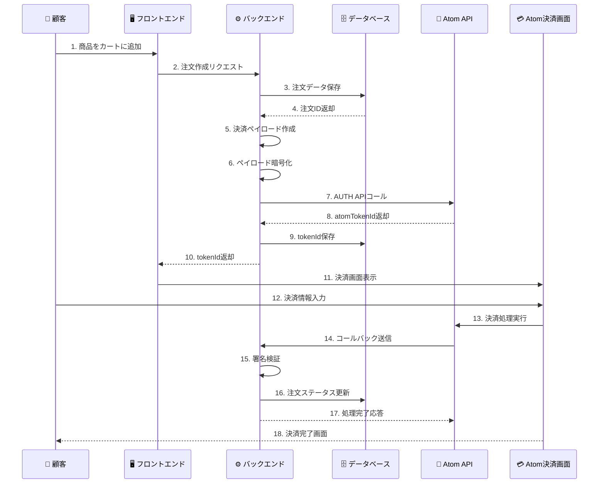

---

## 💸 **リファンドフロー詳細**

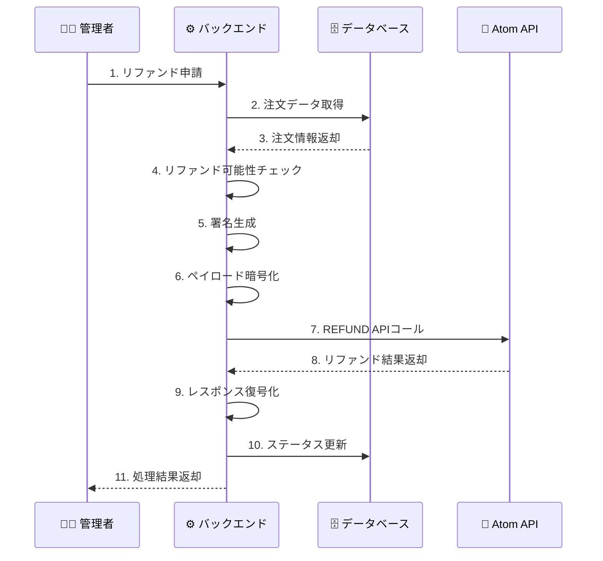

---

## 📊 **データ保存タイミング**

### **決済プロセス中のデータ保存**
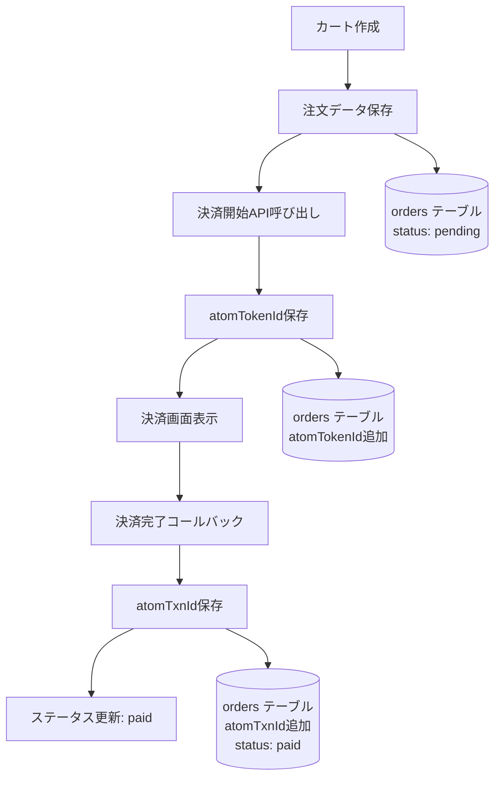

### **リファンドプロセス中のデータ保存**
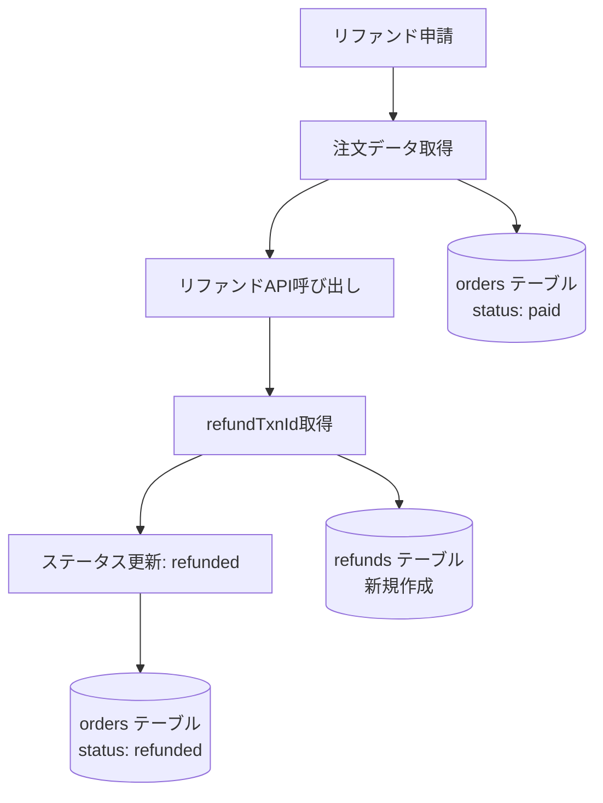

---

## 🔐 **暗号化・署名フロー**

### **リクエスト処理フロー**
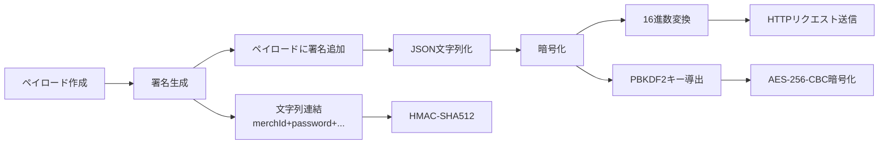

### **レスポンス処理フロー**
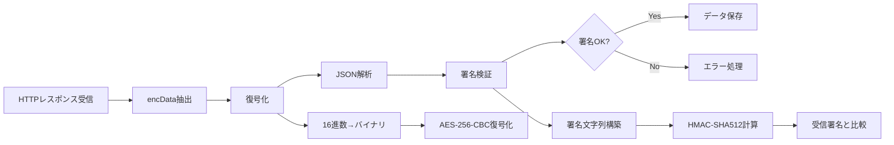

---

## 🗄️ **データベースアクセスパターン**

### **決済時のデータ操作**
```sql
-- 1. 注文作成
INSERT INTO orders (user_id, merch_txn_id, total_amount, status) 
VALUES (?, ?, ?, 'pending');

-- 2. atomTokenId保存
UPDATE orders 
SET atom_token_id = ?, updated_at = NOW() 
WHERE id = ?;

-- 3. 決済完了時
UPDATE orders 
SET atom_txn_id = ?, status = 'paid', payment_method = ?, updated_at = NOW()
WHERE merch_txn_id = ?;
```

### **リファンド時のデータ操作**
```sql
-- 1. 注文データ取得
SELECT id, atom_txn_id, merch_txn_id, total_amount, status 
FROM orders 
WHERE id = ? AND status = 'paid';

-- 2. リファンド記録作成
INSERT INTO refunds (order_id, refund_amount, refund_txn_id, status) 
VALUES (?, ?, ?, 'completed');

-- 3. 注文ステータス更新
UPDATE orders 
SET status = 'refunded', updated_at = NOW() 
WHERE id = ?;
```

---

## 📈 **エラーハンドリングフロー**

### **決済エラー処理**
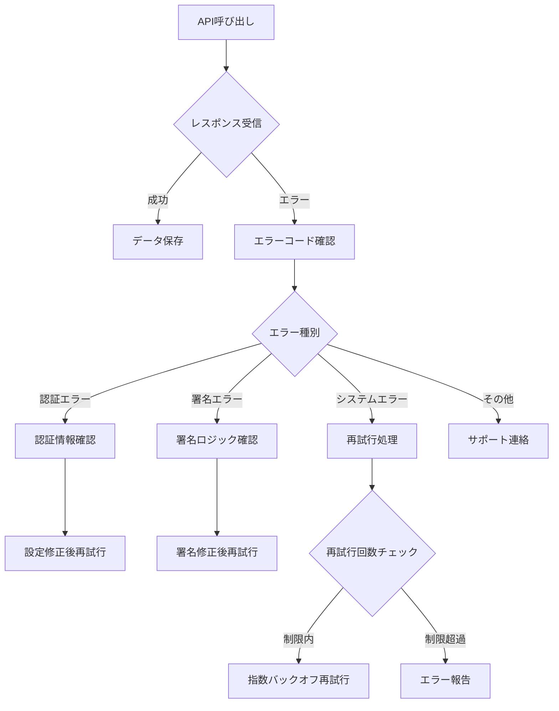

### **リカバリー処理**
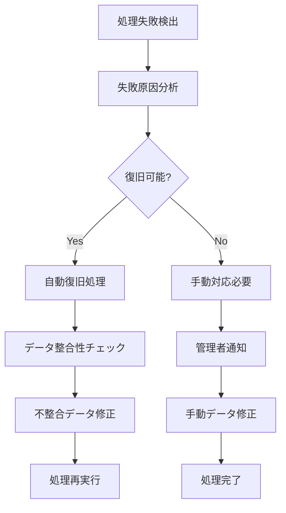

---

## 🔄 **ステータス遷移図**

### **注文ステータス遷移**
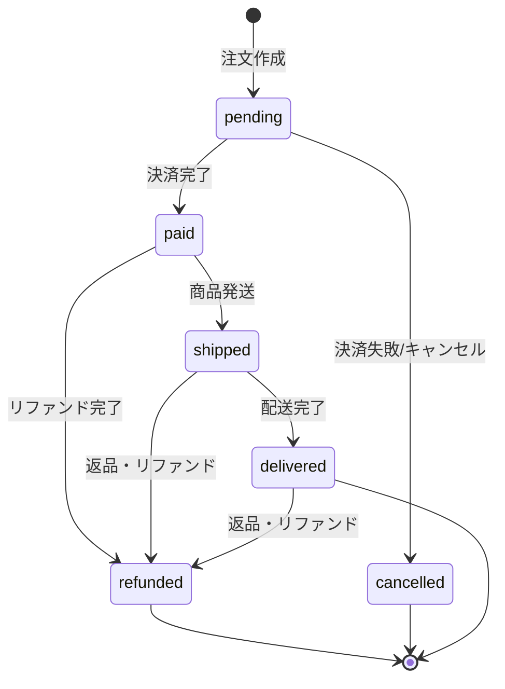

### **決済処理ステータス**
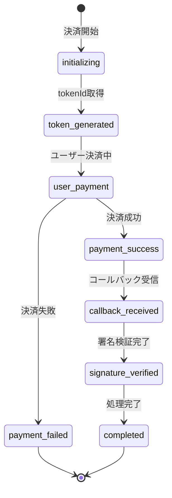

---

## 📊 **パフォーマンス考慮事項**

### **ボトルネック箇所**
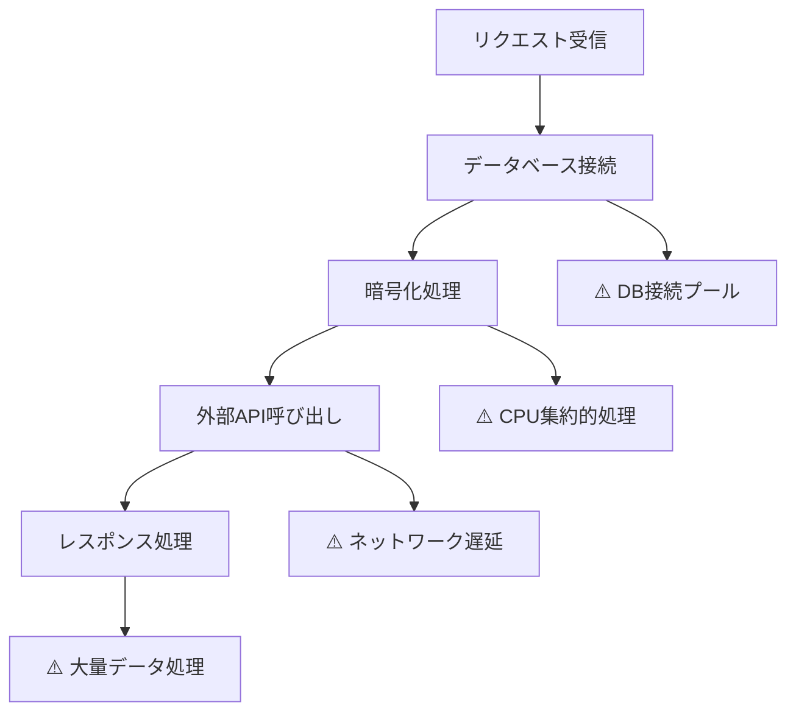

### **最適化ポイント**
- **データベース**: 接続プーリング、インデックス最適化
- **暗号化**: 非同期処理、キャッシュ活用
- **API呼び出し**: タイムアウト設定、リトライ機構
- **メモリ管理**: 大きなペイロードの分割処理

---

## 🔍 **監視・ログポイント**

### **監視すべきメトリクス**
```yaml
決済成功率: payment_success_rate
平均レスポンス時間: avg_response_time
エラー発生率: error_rate
API可用性: api_availability
署名検証失敗率: signature_failure_rate
```

### **ログ出力ポイント**
```javascript
// 重要なログポイント
logger.info('Payment initiated', { orderId, amount });
logger.info('Token received', { atomTokenId });
logger.info('Callback received', { atomTxnId, status });
logger.warn('Signature verification failed', { orderId });
logger.error('API call failed', { error, retryCount });
```